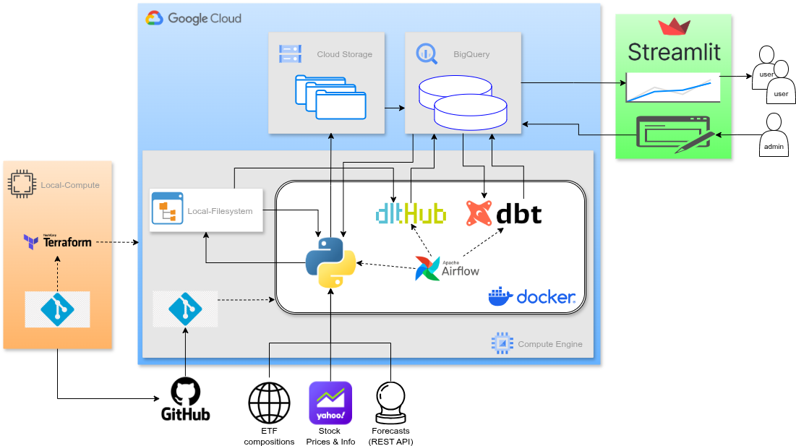
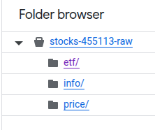
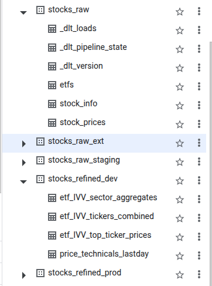
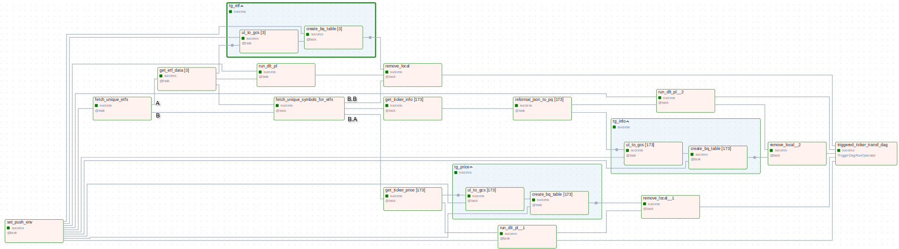
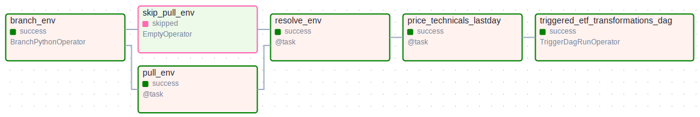
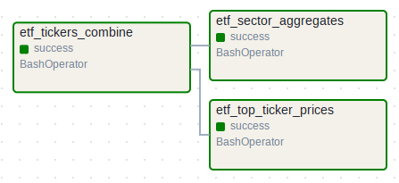
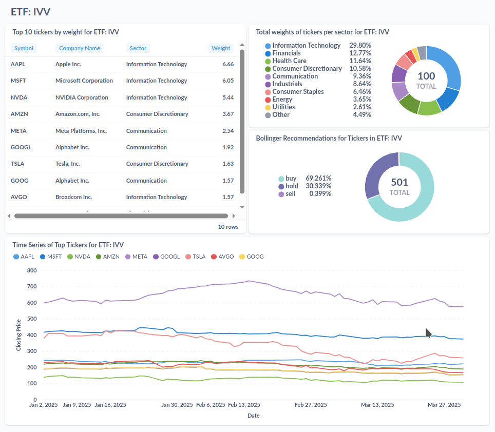

<font size="+12"><center>
    Stocks Analytics
</center></font>

# Motivation and Scope

Understanding the performance of stocks, and particularly of [ETF](https://en.wikipedia.org/wiki/Exchange-traded_fund)'s is not straightforward. Decision to buy or sell stocks or ETFs requires consideration of many factors, such as various financial metrics (a.k.a. [fundamental analysis](https://en.wikipedia.org/wiki/Fundamental_analysis)), and the past price behavior (a.k.a. [technical analysis](https://en.wikipedia.org/wiki/Technical_analysis)) of companies (or their collection in case of ETFs). For the day-traders, the technical analysis may outweight any other factor, and an automated algorithmic trading strategy may be more suitable. However, a long-term investor often need more comprehensive analyses, requiring the integration of various data sources. My goal in this project has been to assist the latter group (which includes myself!), by building a platform that facilitates analyzing stock market assets. Key challenges can be outlined as follows: 
- *Data sources with different time scales*: the price data are available essentially at real time, whereas other metrics, such as financial statements are made available quarterly or annually. ETF compositions can also change over time, more frequently for the actively-managed ETFs and less frequently for index-ETFs. 
- *Monitoring platform*: what an investor needs is often not a one-off analysis, but more of a monitoring platform: typically an investor would like to gain insights at regular intervals. Therefore the underlying data, its processing and visualization needs to be refreshed accordingly.
- *Scalability*: Handling a few dozen or hundred stocks could be managed with classical backend-engineering methods, however, doing this at scale (e.g., potentially thousands of stocks that need to be refreshed frequently) is facilitated by modern data-engineering tools, such as a data warehouse, distributed computing and orchestration solutions.

Considering these challenges and computational costs of solving them, it is no surprise that a plethora of subscription-based (paid) services have emerged to support investors. With this project, I obviously do not aim to compete with these platforms, which would require substantial cloud resources. Rather, my goal has been to explore and experiment with the modern data-engineering tech-stack as part of the [Data Engineering Zoomcamp by the DataTalksClub](https://datatalks.club/blog/data-engineering-zoomcamp.html) - big shout-out to the amazing DataTalksClub lecturers and community! 

So far I have prioritized the more complex problem of ETFs for which the freely available tools are even scarcer than for individual stocks. In the future, I am planning to extend the platform to support individual stock analysis, enhance both fundamental and technical analysis capabilities, introduce forecasting mechanisms, and experiment with LLM-based synthesis and reporting features. I’d love to hear from potential collaborators!

# Solution Architecture

Here is a high-level overview of the solution architecture: 

  
<br/><br/>

3 main environments can be identified:
1. A local development environment (green box): this is where the code is developed/maintained and necessary cloud services (via [Terraform](#terraform)) are managed
2. The cloud environment (blue box): currently the [Google Cloud Platform](https://cloud.google.com/), where the data storage is first temporarily in the local file system, then persisted in cloud services, source code is containerized with [Docker](https://www.docker.com/) (see [Docker](Docker/airflow)), in which data is processed
3. [Metabase Dashboards](#metabase-dashboard) (orange box) served to public

In the following sections, detailed descriptions of [data sources](#data-sources), [data lake and warehouse](#data-lake--warehouse) design, [tools and technical setup](#tools-and-technical-setup), [Data Ingestion](#data-ingestion) and [Data Transformation](#data-transformations) pipelines and finally the [Metabase dashboard](#metabase-dashboard) are provided. 

# Data Sources

## ETF Compositions
ETF holding composition is acquired using python [ETF-Scraper](https://pypi.org/project/etf-scraper/) package. The data includes, most importantly, the ticker symbol, name, and weight of the company held by the ETF.

## Stock Information and Prices
These datasets are acquired via python [yfinance](https://pypi.org/project/yfinance/) package.  'Information' (or info in short) refers to the fundamental information about a given company, such as the sector, market capitalization, earnings per share, etc. Stock Prices refer to the historic daily stock prices (open, close, day-low, day-high) and trading volumes.

# Data Lake & Warehouse

## Data Lake
All the raw data are stored as .parquet files in a GCS bucket, split into three folders: 



Contents of these folders are probably self-evident (see the previous section for the contents of files and how they are generated):
- etf: .parquet files for each of the ETFs being tracked. See the [ETF Compositions](#etf-compositions) 
- info: .parquet files for each company ticker held by any ETF (no duplicates for holdings contained by multiple ETFs). See the [Stock Information](#stock-information) section above for the contents.
- prices: same as for the info files, but containing the daily price history of the company. See the [Stock Prices](#stock-prices) section above for the contents.


## Data Warehouse

The data warehouse contains 3 dataset groups, 2 of which have dev/staging and production variants (therefore totalling 5 datasets):



These dataset groups contain following tables:

### stocks_raw_ext
contains an external table for each .parquet file in the [data lake](#data-lake), called from [Data Ingestion DAG](#data-ingestion), orchestrated by [Airflow](#Airflow).

### stocks_raw
This dataset has two variants for development (suffix: _staging) and production environments (no suffix), where the tables are created by the [dlt (data load tool)](#dlt), called from [Data Ingestion DAG](#data-ingestion), orchestrated by [Airflow](#Airflow). They comprise the following tables (apart from auxiliary dlt files):
- etfs: concateneted [ETF Compositions](#etf-compositions) for all ETFs being tracked, as identified by `fund_ticker` column
- stock_info: concatenated [Stock Information](#stock-information)(see above) for all company tickers being tracked, as identified by `symbol` column
- stock_price: concatenated [Stock Prices](#stock-prices) for all company tickers being tracked, as identified by `symbol` column

This design follows the [star schema](https://en.wikipedia.org/wiki/Star_schema), where the stock_price is a rapidly changing fact table, and the etfs and stock_info are the slower-changing dimensions tables.

### stocks_refined
This dataset has also two variants for the development (indicated with _dev suffix) and production (indicated with _prod suffix) environments, and contains transformed data produced by the [dbt (data build tool)](#dbt), called from [Data Transformation DAG's](#data-transformation), orchestrated by [Airflow](#Airflow). They comprise the following tables:
- etf_{etf_name}_sector_aggregates: for each ETF being tracked, sectoral aggregations: in particular, sum of weights of tickers held by the ETF in each sector 
- etf_{etf_name}_tickers_combined: for each ETF being tracked, combination of select fields from raw etf and info tables, and the price_technicals_last_day (see below)
- etf_{etf_name}_top_ticker_prices: for each ETF being tracked, price (close) of tickers held by the ETF.
- price_technicals_lastday: for each ticker tracked by any ETF, the technical indicators for the last day. 

For the details of the contents of etf_{etf_name} tables, see [ETF Transformations DAGs](#etf-transformations-dag), and for the others (currently only 'price_technicals_lastday'), see [Ticker Transformations DAG](#ticker-transformations-dag).

As the [stocks_raw](#stocks_raw) datasets, this dataset follows a star schema, where the price_technicals_lastday is the rapidly changing fact table, and the etf_{etf_name}_* tables are the dimension tables.

# Tools and Technical Setup
## Cloning the repositories
The repository should be cloned with the `--recursive` argument, i.e., `git clone --recursive git@github.com:OnurKerimoglu/stocks_analytics.git`, such that the [stocks_dbt](https://github.com/OnurKerimoglu/stocks_dbt.git) repository is pulled as a submodule into the `dbt` folder (see the [Airflow](#Airflow) section below for information on the integration of dbt with Airflow).

## Cloud platform: Google Cloud
The project is developed on the Google Cloud Platform. To manage provisioning of required services (so far Cloud Storage and Bigquery), Terraform is used as a Infrastructure as Code (IaC) tool.

### Terraform
[Hashicorp Terraform](https://developer.hashicorp.com/terraform/tutorials/gcp-get-started/infrastructure-as-code) is used to manage Google Cloud services. Required files can be found in the [terraform](terraform) directory. 

## dlt
Some part of the ingestion, specifically, loading the raw ticker data (info and price) to the datawarehouse is done via [dlt (data load tool)](https://dlthub.com/), orchestrated with [Airflow](#Airflow) (see [Data Ingestion DAG](#data-ingestion) below for the process details). 

## dbt
Data transformations are done with [dbt (data build tool) -core](https://docs.getdbt.com/docs/core/installation-overview), orchestrated with [Airflow](#Airflow) (see [Data Transformations](#data-transformations) below for the process details).

## Airflow

1. build and run the docker image (see https://airflow.apache.org/docs/apache-airflow/stable/howto/docker-compose/index.html for general information on how to run airflow with docker compose. Here project specific steps are provided). 
    -  Under the project root, issue:
        - `docker compose -f Docker/airflow/docker-compose.yaml build` to build the containers
        - `docker compose -f Docker/airflow/docker-compose.yaml up` to start the containers
    - Save the Airflow UUID (output of `echo -e "AIRFLOW_UID=$(id -u)"`) into Docker/airflow/.env together with other parameters that might be relevant (see the [.env_example](Docker/airflow/.env_example))

2. export dlt_settings: In Airflow UI, under Admin > Variables create a `dlt_secrets_toml' variable with the contents of the secret.toml (under the default ~/.dlt folder), i.e.
```
destination.bigquery]
location = ****

[destination.bigquery.credentials]
project_id = ****
private_key = ****
client_email = ****
``` 
3. no additional configuration step is needed for dbt. For info, the dbt models are made available to Airflow while building the container with [docker-compose.yaml](Docker/airflow/docker-compose.yaml) by mounting the `dbt` folder  to `/opt/airflow/dbt`, which contains the dbt repository [stocks_dbt](https://github.com/OnurKerimoglu/stocks_dbt.git) as a submodule, which in turn contains the (profiles.yml) file inside a [config](dbt/stocks/dbt/config) folder (which by default is located under the dbt folder, e.g., $HOME/.dbt on Unix systems.). This non-default location for the profiles.yml file requires its specification while making a call to the dbt client (e.g., as in `bash_command=f"dbt run -s <model-name>  --profiles-dir {dbt_dir}/config --project-dir {dbt_dir}"`, where, `dbt_dir` points to `/opt/airflow/dbt/stocks_dbt`). 

# Data Processing Pipelines
## Data Ingestion

### Ingestion DAG
The [ingest_raw_data_dag](dags/ingest_raw_data_dag.py) comprises all ingestion-tasks required for a given ETF (provided as an input argument `ETF_symbol`), so it is somewhat complex: 

<!---

-->


The DAG has 2 main branches: one to process ETF data (branch *A*), another to process the ticker data (branch *B*), which in turn branches into two, that process ticker prices (branch *B.A*) and ticker information (branch *B.B*). In this DAG, all tasks are all python functions with (airflow) `@task` decorator (making them classical `PythonOperator`s). Some tasks are used multiple times in these branches, therefore it makes sense to describe the tasks at a definition (and not instantiation) level (in brackets the branches that contains the tasks are indicated)

- **get_etf_data** *(A, B.A, B.B)*: initializes the `DownloadTickerData` class (in [download_ticker_data.py](src/download_ticker_data.py)) for the `ETF_symbol` (specified as the input argument of the DAG), downloads and stores the entire table to local `data/etf/{ETF_symbol}.parquet` file (folder will be created if not exists), and symbols to `data/{ETF_symbol}.csv` file to facilitate human access
- **fetch_symbols** *(B.A, B.B)*: initializes the `FetchSymbols` class (in [fetch_symbols](src/fetch_symbols.py)) with the filepath of the locally stored csv file (see get_etf_data task above), and returns the ticker symbols as a list 
- **get_ticker_price/info** *(B.A, B.B)*: both of these tasks initialize the `DownloadTickerData` class (in [download_ticker_data](src/download_ticker_data.py) module for a given ticker symbol. Then, the get_ticker_price and et_ticker_info tasks run the download_prices() and download_info() methods of the class and store the acquired data into the local `data/price/{symbol}.parquet` and `data/info/{symbol}.json`, respectively
- **reformat_json_to_pq** *(B.B)*: for a given calls `reformat_json_to_parquet` function from the [shared](src/shared) module to convert the local data from `.json` to `.parquet` format, which is currently required for the ticker info  
- **ul_to_gcs** *(A, B.A, B.B)*: calls the `upload_to_gcs` function from the [gc_functions](src/gc_functions) module to upload a locally stored file into a specified GCS Bucket
- **create_bq_table** *(A, B.A, B.B)*: calls the `GCScreate_bq_external_table_operator` function from the [gc_functions](src/gc_functions) module (which in turn runs an airflow `BigQueryCreateExternalTableOperator` function) to create an external table in Bigquery based on a specified `.parquet` file in a GCS Bucket 
- **run_dlt_pl** *(A, B.A, B.B)*: initializes the `LoadTickerData` class from the [load_ticker_data_dlt.py](src/load_ticker_data_dlt.py) module, and runs the appropriate [dlt](#dlt) pipeline (`run_(etf)(price)(info)_pl`) defined in the class 
- **remove_local (A, B.A, B.B)**: removes local files in a `data/{source}` directory

Note that, for some of these tasks, input arguments are provided as lists with `.expand()` function (made available to the dag function by airflow's `@task` decorator), so that copies of the task are dynamically created at runtime and mapped to the elements of the list, which is an airflow feature known as [Dynamic Task Mapping](https://airflow.apache.org/docs/apache-airflow/stable/authoring-and-scheduling/dynamic-task-mapping.html). The number of copied tasks are shown in the DAG diagram in square brackets.

## Data Transformations

### Ticker Transformations DAG
The [ticker_transformations_dag](dags/ticker_transformations_dag.py) contains a single dbt task, which is a `BashOperator`:



This `BashOperator` issues a dbt CLI command to run [price_technicals_lastday.sql](dbt/stocks_dbt/models/stocks/price_technicals_lastday.sql), purpose of which is, for each ticker in the stocks_prices table in the [stocks_raw](#stocks_raw) dataset, calculating technical indicators that can be summarized for the last day available (so that one record can be produced per ticker in the target table), and write these results into the, price_technicals_lastday table in the [stocks_refined](#stocks_refined) datasets. Currently, the only indicator calculated is the (Bollinger Band Strategy)[https://en.wikipedia.org/wiki/Bollinger_Bands], according to which,

$$
\textrm{BR} = 
\left\lbrace
  \begin{array}{ c l }
    \textrm{sell} & \quad \textrm{if } P \geq \mu_{n}(P) + K\sigma_{n}(P) \\
    \textrm{buy} & \quad \textrm{if } P \leq \mu_{n}(P) - K\sigma_{n}(P) \\
    \textrm{hold}                 & \quad \textrm{otherwise}
  \end{array}
\right.
$$

where BR stands for the Bollinger Recommendation, P is the (closing) Price, $\mu_n(P)$ and $\sigma_n(P)$ are the $n$-day rolling average and standard deviation of Price for the time period, and $K$ is a factor (in the current implementation, $n$=30, $K$=2). As in the current implementation we need the BR only for the last day, the calculation truncates to simple average and standard deviation calculations for the chosen period ($n$=30 days).  

### ETF Transformations DAG
The [etf_transformations_dag](dags/etf_transformations_dag.py) takes an input parameter `ETF_symbol` when triggering, and is comprised of 3 `BashOperator` tasks, 2 of which branches from the first task, and can run in parallel:



These `BashOperator` tasks run dbt models that have names identical to the calling tasks:
- [etf_tickers_combine](dbt/stocks_dbt/models/stocks/etf_tickers_combine.sql): This model, first filters the ticker symbols, weights and sectors of companies that are held for a chosen ETF (as specified the input parameter) from the etfs table (in [stocks_raw](#stocks_raw) datasets), then combines these with a subset of fields from the stock_info table (in [stocks_raw](#stocks_raw) datasets) and price_technicals_lastday table (in the [stocks_refined](#stocks_refined) datasets) (see [Ticker Transformations DAG](#ticker-transformations-dag))
- [etf_sector_aggregates](dbt/stocks_dbt/models/stocks/etf_sector_aggregates.sql): this model builds on the etf_tickers_combine model, basically by applyting various aggregation functions to the fields of this table over sectors.
- [etf_top_ticker_prices](dbt/stocks_dbt/models/stocks/etf_top_ticker_prices.sql): this model mainly choses the most important (by weight) tickers for the specified ETF (i.e., input parameter) from the stock_prices table (in [stocks_raw](#stocks_raw) dataset) by joining with the etf_tickers_combine table created by the first task.

## Metabase Dashboard
For dashboards, [Metabase Open Source](https://www.metabase.com/start/oss/) is used.  For each ETF, a separate dashboard is created. For instance, for IVV, here is how the dashboard looks like:



