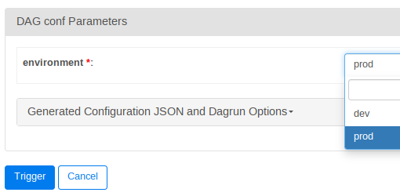
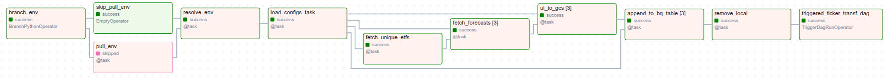

<h1 align="center">
    <strong>Stocks Analytics: A Platform for Monitoring Stocks and ETFs</strong>
</h1>

# Motivation and Scope

Understanding the performance of stocks, and particularly of [ETF](https://en.wikipedia.org/wiki/Exchange-traded_fund)'s is not straightforward. Decision to buy or sell stocks or ETFs requires consideration of many factors, such as various financial metrics (a.k.a. [fundamental analysis](https://en.wikipedia.org/wiki/Fundamental_analysis)), and the past price behavior (a.k.a. [technical analysis](https://en.wikipedia.org/wiki/Technical_analysis)) of companies (or their collection in case of ETFs). For the day-traders, the technical analysis may outweight any other factor, and an automated algorithmic trading strategy may be more suitable. However, a long-term investor often need more comprehensive analyses, requiring the integration of various data sources. My goal in this project has been to assist the latter group (which includes myself!), by building a platform that facilitates analyzing stock market assets. Key challenges can be outlined as follows: 
- *Data sources with different time scales*: the price data are available essentially at real time, whereas other metrics, such as financial statements are made available quarterly or annually. ETF compositions can also change over time, more frequently for the actively-managed ETFs and less frequently for index-ETFs. 
- *Monitoring platform*: what an investor needs is often not a one-off analysis, but more of a monitoring platform: typically an investor would like to gain insights at regular intervals. Therefore the underlying data, its processing and visualization needs to be refreshed accordingly.
- *Scalability*: Handling a few dozen or hundred stocks could be managed with classical backend-engineering methods, however, doing this at scale (e.g., potentially thousands of stocks that need to be refreshed frequently) is facilitated by modern data-engineering tools, such as a data warehouse, distributed computing and orchestration solutions.

Considering these challenges and computational costs of solving them, it is no surprise that a plethora of subscription-based (paid) services have emerged to support investors. With this project, I obviously do not aim to compete with these platforms, which would require substantial cloud resources. Rather, my goal has been to explore and experiment with the modern data-engineering tech-stack as part of the [Data Engineering Zoomcamp by the DataTalksClub](https://datatalks.club/blog/data-engineering-zoomcamp.html) - big shout-out to the amazing DataTalksClub lecturers and community! 

So far I have prioritized the more complex problem of ETFs for which the freely available tools are even scarcer than for individual stocks. In the future, I am planning to extend the platform to support individual stock analysis, enhance both fundamental and technical analysis capabilities, introduce forecasting mechanisms, and experiment with LLM-based synthesis and reporting features. I’d love to hear from potential collaborators!

# Solution Architecture

Here is a high-level overview of the solution architecture: 

  
<br/><br/>

3 main environments can be identified:
1. A local development environment (green box): this is where the code is developed/maintained and necessary cloud services (via [Terraform](#terraform)) are managed
2. The cloud environment (blue box): currently the [Google Cloud Platform](https://cloud.google.com/) (see: [cloud services](#cloud-services)), where source code is pulled from GitHub (automated via [scripts/startup.sh](scripts/startup.sh), which is set with the creation of the compute engine resource with Terraform), ran in a [Docker](https://www.docker.com/) container (see [Docker](Docker/airflow)), and data is persisted and processed in a data lake and data warehouse
3. [Streamlit Web-App](#streamlit-web-app) (orange box) that contains publicly accessible dashboards and admin interfaces to browse and manage ETFs to track.

In the following sections, detailed descriptions of [data sources](#data-sources), employed [cloud services](#cloud-services) including [data warehouse](#data-warehouse) design, [tools and technical setup](#tools-and-technical-setup), [data integration](#data-integration) pipelines and finally a brief description and link for an interactive [Streamlit Web-App](#streamlit-web-app) are provided. 

# Data Sources

## ETF Compositions
ETF holding composition is acquired using python [ETF-Scraper](https://pypi.org/project/etf-scraper/) package. The data includes, most importantly, the ticker symbol, name, and weight of the company held by the ETF.

## ETF Forecasts
ETF Forecasts are obtained based on historic data from a REST API (maintained by myself), for which the URL provided as a secret in .env and copied to airflow docker-compose file (to prevent public access). Infrastucture for training the forecast model, and its deployment is explained in my [forecasting project](https://github.com/OnurKerimoglu/stocks_forecasting_live). 

## Stock Information and Prices
These datasets are acquired via python [yfinance](https://pypi.org/project/yfinance/) package.  'Information' (or info in short) refers to the fundamental information about a given company, such as the sector, market capitalization, earnings per share, etc. Stock Prices refer to the historic daily stock prices (open, close, day-low, day-high) and trading volumes.

# Cloud Services

The project is developed on the [Google Cloud Platform](https://cloud.google.com). To manage provisioning of required services, I used
(i.e., Cloud Storage, Bigquery and Cloud Compute), [Hashicorp Terraform](https://developer.hashicorp.com/terraform/tutorials/gcp-get-started/infrastructure-as-code) as a Infrastructure as Code (IaC) tool. Required files can be found in the [terraform](terraform) directory. 


For being able to manage (create/destroy) the employed services, I created a service account with following roles:
- BigQuery Admin
- Compute Instance Admin (v1)
- Compute Network Admin
- Compute ORganization Firewall Policy Admin
- Compute Security Admin
- Create Service Accounts
- Storage Admin

## Compute Instance
For setting up terraform to create the compute instance to host airflow, [this resource](https://cloud.google.com/blog/products/data-analytics/different-ways-to-run-apache-airflow-on-google-cloud) has been helpful. I tested two VM's: 

**VM1:**
This is a n2d-standard-2 instance (single core with 2 vCPUs, 8 GB Memory) with 20 GB disk size, and [Container-Optimized OS (COS)](https://cloud.google.com/container-optimized-os/docs) as the operating system (see 'vm1' variables in: [variables.tf](terraform/variables.tf)). Although COS comes with a preinstalled docker, it does not include the compose plugin, which therefore needs to be installed manually:
``` 
DOCKER_CONFIG=${DOCKER_CONFIG:-$HOME/.docker};\
CLI_PLUGINS=/var/lib/docker/cli-plugins;\
mkdir -p $DOCKER_CONFIG;\
sudo mkdir -p $CLI_PLUGINS;\
sudo curl -SL https://github.com/docker/compose/releases/download/v2.31.0/docker-compose-linux-x86_64 -o $CLI_PLUGINS/docker-compose;\
sudo chmod -R 755 /var/lib/docker;\
sudo ln -s $CLI_PLUGINS $DOCKER_CONFIG/cli-plugins 
```
This instance proved to be too limiting: as the DAG was running, it was not possible to establish an ssh connection with the machine. I also did not like that COS does not allow installing packages. Therefore I tested a second, slightly stronger VM instance.

**VM2:**
This one is a n2d-standard-4 instance (single core with 4 vCPUs, with a total of 16 GB Memory) with 30 GB disk size, and [Ubuntu Minimal 22.04 LTS](https://cloud-images.ubuntu.com/minimal/releases/jammy/release/) as the operating system (see: 'vm2' variables in [variables.tf](terraform/variables.tf)). This is a([minimal](https://wiki.ubuntu.com/Minimal)) Linux distro with optimized boot process and reduced package set, but with apt package manager that makes it easy to extend. Using this VM was much more comfortable with the current setup.


In both instances, the key of the service-account needs to be downloaded and copied to the VM instance:
```
gcloud compute scp ~/gcp-keys/<filename.json> stocks-scheduler:
```
then inside the VM, move the file to the expected location with `mkdir gcp-keys; mv ~/<filename.json> gcp-keys`.

See section: [Airflow](#airflow) for the instructions on setting up the Airflow environment.

## Data Lake
All the raw data are stored as .parquet files in two GCS buckets, one for `prod` and one for `dev` environments, with the following structure:

```
<shared.project>
└── <${env}.bucket>
    ├── etf
    ├── forecast
    ├── info
    ├── price
    └──  <${env}.DS_raw>
        ├── <shared.T_etfs>
        ├── <shared.T_info>
        └── <shared.T_prices>
```
where <x.y> are in reference to blocks and variables defined in the config file [Docker/airflow/config/dwh.yaml](Docker/airflow/config/dwh.yaml) and `${env}` is either `dev` or `prod`. Note that, once the GCS resources are created with Terraform (see above), these folders do not need to be created manually. 

These folders contain the following:
- `etf`: .parquet files for each of the ETFs being tracked. See the [ETF Compositions](#etf-compositions)
- `forecast`: .parquet files containing the forecasts for each ETF.
- `info`: .parquet files for each company ticker held by any ETF (no duplicates for holdings contained by multiple ETFs). See the [Stock Information and Prices](#stock-information-and-prices) section above for the contents.
- `prices`: same as for the info files, but containing the daily price history of the company. See the [Stock Information and Prices](#stock-information-and-prices)  section above for the contents. This table is clustered by `symbol` column for improved query performance.
- `<${env}.DS_raw>`: this folder serve as the staging area for the dlt pipelines (see *run_dlt_pl* task under [Ingestion DAG](#ingestion-dag) that load the data to the datawarehouse, and as such, the subfolders mirror the tables under the `<${env}.DS_raw>` datasets.

## Data Warehouse

The data warehouse contains 4 dataset groups, each having `dev/prod` variants:

```
<shared.project>
├── <${env}.DS_raw>
|   ├── etfs
|   ├── stock_forecasts
|   ├── stock_info
|   └── stock_prices
├── <${env}.DS_rawext>
|   ├── etf_${etf_symbol}
|   ├── info_${holding_symbol}
|   └── price_${holding_symbol}
├── <${env}.DS_refined>
|   ├── etf_forecasts_latest
|   ├── etf_${etf_symbol}_sector_aggregates
|   ├── etf_${etf_symbol}_tickers_combined
|   ├── etf_${etf_symbol}_top_ticker_prices
|   └── price_technicals_lastday
└──  <${env}.DS_user>
    └── <${shared}.T_etfs2track>
```
where (as in the case of data lake explained above), <x.y> are in reference to blocks and variables defined in the config file [Docker/airflow/config/dwh.yaml](Docker/airflow/config/dwh.yaml) and `${env}` is either `dev` or `prod`.

These dataset groups contain following tables:

### <${env}.DS_raw>
This dataset has two variants for development (suffix: _staging) and production environments (no suffix), where the tables are created by the [dlt (data load tool)](#dlt), called from [Ingestion DAG](#ingestion-dag), orchestrated by [Airflow](#Airflow). They comprise the following tables (apart from auxiliary dlt files):
- etfs: concateneted [ETF Compositions](#etf-compositions) for all ETFs being tracked, as identified by `fund_ticker` column
- stock_forecasts: raw forecasts are simply appended to this table (no merges, no overwrites). To prevent overgrowth, a TTL of 35 days are set for `asof` (date of forecast) field.
- stock_info: concatenated [Stock Information](#stock-information)(see above) for all company tickers being tracked, as identified by `symbol` column
- stock_price: concatenated [Stock Prices](#stock-prices) for all company tickers being tracked, as identified by `symbol` column. 

This design follows the [star schema](https://en.wikipedia.org/wiki/Star_schema), where the stock_price is a rapidly changing fact table, and the etfs and stock_info are the slower-changing dimensions tables.

### <${env}.DS_rawext>
contains external tables for each .parquet file in `etf`, `info` and `price` folders in [data lake](#data-lake), called from [Ingestion DAG](#ingestion-dag). Specifically;
- `etf_forecasts_latest`: isolates the latest forecasts for each `etf_symbol` from the `stock_forecasts` table (see above)
- `etf_${etf_symbol}`: contain tables for each `etf_symbol` being tracked, listing the holdings tracked by the etfs (typically 10s/100s of holdings per ETF)
- `info_${holding_symbol}`: contain info tables for each `holding_symbol` contained in any of the ETFs being tracked, listing the fundamental holding data such P/E ratio, for instance (one record per holding)
- `price_${holding_symbol}`: contain price tables for each `holding_symbol` contained in any of the ETFs being tracked, listing daily price (open, close, high, low, volume) histories (typically 100s/1000s of records per holding)

### <${env}.DS_refined>
This dataset has also two variants for the development (indicated with _dev suffix) and production (indicated with _prod suffix) environments, and contains transformed data produced by the [dbt (data build tool)](#dbt), called from data transformation DAG's (see: [data integration](#data-integration)), orchestrated by [Airflow](#Airflow). They comprise the following tables:
- `etf_${etf_name}_sector_aggregates`: for each ETF being tracked, sectoral aggregations: in particular, sum of weights of tickers held by the ETF in each sector 
- `etf_${etf_name}_tickers_combined`: for each ETF being tracked, combination of select fields from raw etf and info tables, and the price_technicals_last_day (see below)
- `etf_${etf_name}_top_ticker_prices`: for each ETF being tracked, price (close) of tickers held by the ETF.
- `price_technicals_lastday`: for each ticker tracked by any ETF, the technical indicators for the last day. 

For the details of the contents of etf_{etf_name} tables, see [ETF Transformations DAGs](#etf-transformations-dag), and for the others (currently only 'price_technicals_lastday'), see [Ticker Transformations DAG](#ticker-transformations-dag). This dataset also follows a star schema, where the price_technicals_lastday is the rapidly changing fact table, and the `etf_{etf_name}_*` tables are the dimension tables.

### <${env}.DS_user>
This dataset contains only the <${shared}.T_etfs2track> table so far, which lists ETF symbols tracked by each user (email). This table is (for now) controlled by a system admin, and is (read-only) accessed by the [Ingestion DAG](#ingestion-dag) to retrieve the list of ETFs to be processed.  

# Technical Setup and Tools
In Linux environments, an end-to-end technical setup can be handled with [scripts/init.sh](scripts/init.sh) (which will be copied to the VM and ran there once during the creation of the compute engine resource with Terraform). No additonal steps should be necessary, but here are a few words on the role of tools being used, and some notes on the technicalities.

## Cloning the repositories
The repository should be cloned with the `--recursive` argument, i.e., `git clone --recursive https://github.com/OnurKerimoglu/stocks_analytics.git`, such that the [stocks_dbt](https://github.com/OnurKerimoglu/stocks_dbt.git) repository is pulled as a submodule into the `dbt` folder (see the [Airflow](#Airflow) section below for information on the integration of dbt with Airflow).

## Airflow
Airflow is responsible for the orchestration and scheduling of the [Data Integration](#data-integration) pipelines using python routines, [dlt](#dlt) and [dbt](#dbt). As mentioned above, the whole technical setup can be performed with [scripts/init.sh](scripts/init.sh), but in here is an outline of the steps.

1. install docker and docker compose (for ubuntu: https://docs.docker.com/engine/install/ubuntu/#install-using-the-repository) and start the docker service

2. build and run the docker image (see https://airflow.apache.org/docs/apache-airflow/stable/howto/docker-compose/index.html for general information on how to run airflow with docker compose. Here project specific steps are provided). 
    -  Under the project root, issue:
        - `docker compose -f Docker/airflow/docker-compose.yaml build` to build the containers
        - `docker compose -f Docker/airflow/docker-compose.yaml up` to start the containers
    - Save the Airflow UUID (output of `echo -e "AIRFLOW_UID=$(id -u)"`) into Docker/airflow/.env (see the [.env_example](Docker/airflow/.env_example))

2. Running [dlt](#dlt) from Airflow requires an Airflow variable named `dlt_secrets_toml`  (equivalent to a {DLT_DIR}/secrets.toml when running dlt directly). Setting this environment variable is done automatically by the first task of the [Ingestion DAG](#ingestion-dag). But iff needed, it can also be set manually in Airflow UI, under Admin > Variables, with the following content:
```
[destination.bigquery]
location = ****

[destination.filesystem]
bucket_url = "gs://****"

[destination.bigquery.credentials]
project_id = ****
private_key = ****
client_email = ****
```
Note that, here the bucket_url is required for being able to make use of the [staging functionality of dlt](https://dlthub.com/docs/dlt-ecosystem/staging).

3. no additional configuration step is needed for [dbt](#dbt). For info, the dbt models are made available to Airflow while building the container with [docker-compose.yaml](Docker/airflow/docker-compose.yaml) by mounting the `dbt` folder  to `/opt/airflow/dbt`, which contains the dbt repository [stocks_dbt](https://github.com/OnurKerimoglu/stocks_dbt.git) as a submodule, which in turn contains the (profiles.yml) file inside a [config](dbt/stocks/dbt/config) folder (which by default is located under the dbt folder, e.g., $HOME/.dbt on Unix systems.). This non-default location for the profiles.yml file requires its specification while making a call to the dbt client (e.g., as in `bash_command=f"dbt run -s <model-name>  --profiles-dir {dbt_dir}/config --project-dir {dbt_dir}"`, where, `dbt_dir` points to `/opt/airflow/dbt/stocks_dbt`). 

4. (If Airflow is hosted on a remote machine): the webserver port needs to be forwarded to a `local-port`, from which Airflow UI can be displayed. On a terminal `ssh -L <local-port>:localhost:8081 <user>@stocks-scheduler -N` (note that [Docker-compose.yml](Docker/airflow/docker-compose.yaml) specifies the non-default 8081 as the webserver port).

## dlt
Loading of the raw ticker data (info and price) to the datawarehouse is done via [dlt (data load tool)](https://dlthub.com/). 

## dbt
Data transformations are done primarily with [dbt (data build tool) -core](https://docs.getdbt.com/docs/core/installation-overview).


# Data Integration
Data integration is done with ELT method: Data is first extracted and loaded to the data warehouse (by the [Ingestion DaG](#ingestion-dag)), which are then transformed (by [Ticker Transformation DAG](#ticker-transformations-dag) and [ETF Transformation DAG](#etf-transformations-dag). All pipelines are scheduled and orchestrated via [Airflow](#Airflow). Scheduled operations (see below) are run for the default `prod` environment, whereas for the manual runs, the user can specify the environment (`prod` or `dev`) when triggering the dags:



## Ingestion DAG
The [ingest_raw_data_dag](dags/ingest_raw_data_dag.py) is the only scheduled dag that runs once a week, specifically on Saturday at 1 AM CET. It comprises all ingestion-tasks, so it is fairly complex. An example run that processed the data for 3 ETFs, which contained 173 unique holdings is shown here:

<!---

-->


The DAG has 2 main branches: one to process ETF data (branch *A*), another to process the ticker data (branch *B*), which in turn branches into two, that process ticker prices (branch *B.A*) and ticker information (branch *B.B*). In this DAG, all tasks are all python functions with (airflow) `@task` decorator (making them classical `PythonOperator`s). Some tasks are used multiple times in these branches, therefore it makes sense to describe the tasks at a definition (and not instantiation) level (in brackets the branches that contains the tasks are indicated):

- **set_push_env** *(A, B)*:  this task reads the configuration parameter `env`, pushes it to `Xcom`, loads the configs under [Docker/airflow/config](Docker/airflow/config) according to the specified environment and returns the cloud constants such as bucket, dataset and table names in a dictionary, which are used in downstream tasks. This task also sets an Airflow variable `dlt_secrets_toml` consistent with the `env` and cloud constants.
- **fetch_unique_etfs** *(A, B)*: this task fetches all unique ETFs from the <${env}.DS_user>.<${shared}.T_etfs2track table (see [data warehouse](#data-warehouse)), and returns them as a list.
- **get_etf_data** *(A, B)*: this task is dynamically mapped to each ETF retrieved by the `fetch_unique_etfs` task (in the example shown in the image, 3 times). Then each of these subtasks initializes the `DownloadTickerData` class (in [download_ticker_data.py](src/download_ticker_data.py)) for the `ETF_symbol`, downloads and stores the entire table to local `data/etf/{ETF_symbol}.parquet` file (folder will be created if not exists), and symbols to `data/{ETF_symbol}.csv` file to facilitate human access.
- **fetch_unique_symbols_for_etfs** *(B.A, B.B)*: this task takes the list of `ETF_symbol`s from the `fetch_unique_etfs` task as its input. Then it loops over these symbols, initializing the `FetchSymbols` class (in [fetch_symbols](src/fetch_symbols.py)) with the filepath of the locally stored csv file (see get_etf_data task above), aggregating the ticker symbols as a list, and returning the unique elements of the list (173 in the example shown in the image above)
- **get_ticker_price/info** *(B.A, B.B)*: both of these tasks initialize the `DownloadTickerData` class (in [download_ticker_data](src/download_ticker_data.py) module for a given ticker symbol. Then, the get_ticker_price and et_ticker_info tasks run the download_prices() and download_info() methods of the class and store the acquired data into the local `data/price/{symbol}.parquet` and `data/info/{symbol}.json`, respectively
- **reformat_json_to_pq** *(B.B)*: for a given calls `reformat_json_to_parquet` function from the [shared](src/shared) module to convert the local data from `.json` to `.parquet` format, which is currently required for the ticker info  
- **ul_to_gcs** *(A, B.A, B.B)*: calls the `upload_to_gcs` function from the [gc_functions](src/gc_functions) module to upload a locally stored file into a specified GCS Bucket
- **create_bq_table** *(A, B.A, B.B)*: calls the `GCScreate_bq_external_table_operator` function from the [gc_functions](src/gc_functions) module (which in turn runs an airflow `BigQueryCreateExternalTableOperator` function) to create an external table in Bigquery based on a specified `.parquet` file in a GCS Bucket 
- **run_dlt_pl** *(A, B.A, B.B)*: initializes the `LoadTickerData` class from the [load_ticker_data_dlt.py](src/load_ticker_data_dlt.py) module, and runs the appropriate [dlt](#dlt) pipeline (`run_(etf)(price)(info)_pl`) defined in the class 
- **remove_local** *(A, B.A, B.B)*: removes local files in a `data/{source}` directory
- **triggered_etf_fcst_dag** *(B.A, B.B)*: this is not a task, but a trigger for the [ETF Forecasts DAG](#etf-forecasts-dag) that runs after the dlt pipelines for both price and info are finalized

Note that, for some of these tasks, input arguments are provided as lists with `.expand()` function (made available to the dag function by airflow's `@task` decorator), so that copies of the task are dynamically created at runtime and mapped to the elements of the list, which is an airflow feature known as [Dynamic Task Mapping](https://airflow.apache.org/docs/apache-airflow/stable/authoring-and-scheduling/dynamic-task-mapping.html).

## Resolution of the Environment
The subsequent dags can take `env` input parameter, which is configured for three options: `dev`, `prod` or `upstream` (default). The environment to take effect is resolved with following logic:

- `branch_env`: this is a `BranchPythonOperator`, which returns `pull_env` as the task if the `env` input parameter is `upstream`, otherwise (i.e., for `dev` or `prod`), it returns `skip_pull_env`, which is an `EmptyOperator`.
- `pull_env`: this task Xcom-pulls `env` parameter, which was pushed by the `set_push_env` task under [Ingestion DAG](#ingestion-dag). Finally, it pushes the value of `env` to Xcom as `upstream_env`.
- `resolve_env`: this task is defined with `trigger_rule=TriggerRule.NONE_FAILED_MIN_ONE_SUCCESS`, so that it runs when any of the upstream tasks (i.e., `branch_env` or `pull_env`) succeeds. It reads the input parameter `env`; if its value is `upstream`, it attempts to pull the Xcom `upstream_env`. If the return value turns out to be `None`, which happens for scheduled tasks (apprently due to the mistmatching `execution_date`), it falls back to a default environment, which is globally defined in the module to be `prod`. If the input arg `env` is not `upstream`, it is taken as is. Then the final value is pushed to Xcom as `resolved_env`

## ETF Forecasts DAG

This  [ETF Forecasts dag](dags/etf_forecasts_dag.py) can take `env` as its input parameter, but can also pull the `env` defined upstream, exactly as described for the previous DAG (see: [Resolution of the Environment](#resolution-of-the-environment)). These are the first 4 tasks left of the image:



The subsequent tasks are:
- **fetch_unique_etfs**: fetches the ETF symbols for which forecasts will be fetched
- **fetch_forecasts**: this is the core task, which, for each ETF: *i*) reads the recent historic (closing) price data from the price table (see above); *ii*) fetches the forecast based on the historic data (see [ETF Forecasts](#etf-forecasts)) and stores the results as a parquet file in the local filesystem, under `data/price/{symbol}.parquet`
- **ul_to_gcs**: for each ETF, uploads the locally stored  parquet file to GCS `raw` bucket, under `/forecast/` prefix 
- **append_to_bq_table**: for each ETF, appends the parquet file in GCS to the `stock_forecasts` table under `stocks_raw(_dev)` dataset in BQ
- **remove_local**: removes all local .parquet files
- **triggered_ticker_transf_dag**: triggers the [Ticker transformations dag](#ticker-transformations-dag).

## Ticker Transformations DAG

This  [ticker transformations dag](dags/ticker_transformations_dag.py) can take `env` as its input parameter, but can also pull the `env` defined upstream, exactly as described for the previous DAG (see: [Resolution of the Environment](#resolution-of-the-environment)). These are the first 4 tasks left of the image:


The next task, `price_technicals_lastday` is the only task that actually does something in this DAG: it issues a dbt CLI command to run [price_technicals_lastday.sql](dbt/stocks_dbt/models/stocks/price_technicals_lastday.sql), for the `resolved_env` (see above) as its `target`. Purpose of this model is, for each ticker in the stocks_prices table in the [stocks_raw](#stocks_raw) dataset, calculating technical indicators that can be summarized for the last day available (so that one record can be produced per ticker in the target table), and write these results into the, price_technicals_lastday table in the [stocks_refined](#stocks_refined) datasets. Currently, the only indicator calculated is the (Bollinger Band Strategy)[https://en.wikipedia.org/wiki/Bollinger_Bands], according to which,

$$
\textrm{BR} = 
\left\lbrace
  \begin{array}{ c l }
    \textrm{sell} & \quad \textrm{if } P \geq \mu_{n}(P) + K\sigma_{n}(P) \\
    \textrm{buy} & \quad \textrm{if } P \leq \mu_{n}(P) - K\sigma_{n}(P) \\
    \textrm{hold}                 & \quad \textrm{otherwise}
  \end{array}
\right.
$$

where BR stands for the Bollinger Recommendation, P is the (closing) Price, $\mu_n(P)$ and $\sigma_n(P)$ are the $n$-day rolling average and standard deviation of Price for the time period, and $K$ is a factor (in the current implementation, $n$=30, $K$=2). As in the current implementation we need the BR only for the last day, the calculation truncates to simple average and standard deviation calculations for the chosen period ($n$=30 days).

The final task, `triggered_etf_transformations_dag` is a trigger for the next DAG. 

## ETF Transformations DAG
This  [etf transformations dag](dags/etf_transformations_dag.py) can take `env` as its input parameter, but can also pull the `env` defined upstream, exactly as described for the previous DAG (see: [Resolution of the Environment](#resolution-of-the-environment)). These are the first 4 tasks left of the image:


Then the `load_configs_task` loads the config files according to the `resolved_env`, and returns a dictionary containing the GC bucket, dataset and table names, which is needed for the next task, `fetch_unique_etfs`. This task, like in the case of [Ingestion DAG](#ingestion-dag), fetches all unique ETFs from the <${env}.DS\_user>.<${shared}.T_etfs2track table (see [data warehouse](#data-warehouse)), and returns them as a list.

Subsequent 3 tasks are then mapped to each of these `ETF_symbols` returned by the `fetch_unique_etfs` task (i.e., for 3 ETFs in the example run shown in the image above). These tasks run dbt models for the `resolved_env` (see above) as its `target`, names of which are identical to those of the calling tasks:
- [etf_forecasts_isolate_latest](dbt/stocks_dbt/models/stocks/etf_forecasts_latest.sql): This model isolates the chronoglogically latest forecasts according to `asof` field 
- [etf_tickers_combine](dbt/stocks_dbt/models/stocks/etf_tickers_combine.sql): This model first filters the ticker symbols, weights and sectors of companies that are held for a chosen ETF (as specified the input parameter) from the etfs table (in [stocks_raw](#stocks_raw) datasets), then combines these with a subset of fields from the stock_info table (in [stocks_raw](#stocks_raw) datasets) and price_technicals_lastday table (in the [stocks_refined](#stocks_refined) datasets), and stores the result in Table: `etf_{ETF_symbol}_tickers_combined` (see [Ticker Transformations DAG](#ticker-transformations-dag))
- [etf_sector_aggregates](dbt/stocks_dbt/models/stocks/etf_sector_aggregates.sql): this model builds on the etf_tickers_combine model, basically by applyting various aggregation functions to the fields of this table over sectors.
- [etf_top_ticker_prices](dbt/stocks_dbt/models/stocks/etf_top_ticker_prices.sql): this model mainly choses the most important (by weight) tickers for the specified ETF (i.e., input parameter) from the stock_prices table (in [stocks_raw](#stocks_raw) dataset) by joining with the etf_tickers_combine table created by the first task.


# Streamlit Web-App
After initial experimentation with Metabase and Looker, I decided to build a [Streamlit](https://streamlit.io)) web app, not only because it is free to use for open source projects, but also because the flexibility it offers. The web-app contains not only publicly accessible dashboard ([https://stocks-analytics-dashboard.streamlit.app/](https://stocks-analytics-dashboard.streamlit.app/)) but also admin pages that facilitate browse and manage ETFs to track. Check out the code repository (and its readme for a more detailed description) here: [https://github.com/OnurKerimoglu/stocks_analytics_dashboard](https://github.com/OnurKerimoglu/stocks_analytics_dashboard).
