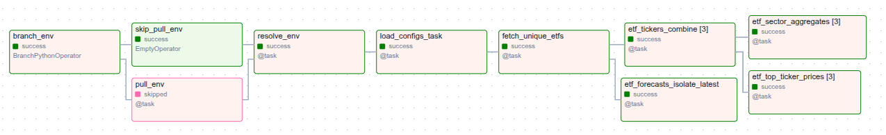

# Stocks Analytics

## Problem Description
Data and visualisations to help understand the value and performance of stocks, and particularly of [ETF](https://en.wikipedia.org/wiki/Exchange-traded_fund)'s are not freely available, although many subscription-based (payed) platforms for the purpose exists. TODO: examples, etc

## Solution Architecture
TODO: draw.io diagram

## Data Sources

### ETF Compositions
These data provide, most importantly, the ticker symbol, name, and weight of the company held by the ETF (TODO: describe etf_scraper function call)

### Stock Information
These refer to the fundamental information about a given company, such as the sector, market capitalization, earnings per share, etc. (TODO: describe yfinance function call)

### Stock Prices
These refer to the historic daily stock prices (open, close, day-low, day-high) and trading volumes. (TODO: describe yfinance function call)

## Data Lake & Warehouse

### Data Lake
All the raw data are stored as .parquet files in a GCS bucket, split into three folders: 


Contents of these folders are probably self-evident (see the previous section for the contents of files and how they are generated):
- etf: .parquet files for each of the ETF's being tracked. See the [ETF Compositions](#etf-compositions) 
- info: .parquet files for each company ticker held by any ETF (no duplicates for holdings contained by multiple ETF's). See the [Stock Information](#stock-information) section above for the contents.
- prices: same as for the info files, but containing the daily price history of the company. See the [Stock Prices](#stock-prices) section above for the contents.


### Data Warehouse

The data warehouse contains 3 dataset groups, 2 of which have dev/staging and production variants (therefore totalling 5 datasets):


These dataset groups contain following tables:

#### stocks_raw_ext
contains an external table for each .parquet file in the [data lake](#data-lake), called from [Data Ingestion DAG](#data-ingestion), orchestrated by [Airflow](#Airflow).

#### stocks_raw_staging (dev) and stocks_raw (prod)
these tables are created by the [dlt (data load tool)](#dlt), called from [Data Ingestion DAG](#data-ingestion), orchestrated by [Airflow](#Airflow). They comprise the following tables (apart from auxiliary dlt files):
- etfs: concateneted [ETF Compositions](#etf-compositions) for all ETF's being tracked, as identified by `fund_ticker` column
- stock_info: concatenated [Stock Information](#stock-information)(see above) for all company tickers being tracked, as identified by `symbol` column
- stock_price: concatenated [Stock Prices](#stock-prices) for all company tickers being tracked, as identified by `symbol` column

This design follows the [star schema](https://en.wikipedia.org/wiki/Star_schema), where the stock_price is a rapidly changing fact table, and the etfs and stock_info are the slower-changing dimensions tables.

#### stocks_refined_dev and stocks_refined_prod:
these tables are transformed data produced by the [dbt (data build tool)](#dbt), called from [Data Transformation DAG's](#data-transformation), orchestrated by [Airflow](#Airflow). They comprise the following tables:
- etf_{etf_name}_sector_aggregates: for each ETF being tracked, sectoral aggregations: in particular, sum of weights of tickers held by the ETF in each sector 
- etf_{etf_name}_tickers_combined: for each ETF being tracked, combination of select fields from raw etf and info tables, and the price_technicals_last_day (see below)
- etf_{etf_name}_top_ticker_prices: for each ETF being tracked, price (close) of tickers held by the ETF.
- price_technicals_lastday: for each ticker tracked by any ETF, the technical indicators for the last day. 

For the details of the contents of etf_{etf_name} tables, see [ETF Transformations DAGs](#etf-transformations-dag), and for the others (currently only 'price_technicals_lastday'), see [Ticker Transformations DAG](#ticker-transformations-dag).

[//]: <> (TODO: design?)

## Tools and Technical Setup
### First steps
The repository should be cloned with the `--recursive` argument, i.e., `git clone --recursive git@github.com:OnurKerimoglu/stocks_analytics.git`, such that the [stocks_dbt](https://github.com/OnurKerimoglu/stocks_dbt.git) repository is pulled as a submodule into the `dbt` folder (see the [Airflow](#Airflow) section below for information on the integration of dbt with Airflow).

### Platform: Google Cloud
#### Terraform

### dlt
Some part of the ingestion is done via dlt (data load tool), orchestrated with Airflow. 

### dbt
Transformations are done with dbt (data build tool), orchestrated with Airflow.

### Airflow

1. build and run the docker image (see https://airflow.apache.org/docs/apache-airflow/stable/howto/docker-compose/index.html for general information on how to run airflow with docker compose. Here project specific steps are provided). 
    -  Under the project root, issue:
        - `docker compose -f Docker/airflow/docker-compose.yaml build` to build the containers
        - `docker compose -f Docker/airflow/docker-compose.yaml up` to start the containers
    - Save the Airflow UUID (output of `echo -e "AIRFLOW_UID=$(id -u)"`) into Docker/airflow/.env together with other parameters that might be relevant (see the [.env_example](Docker/airflow/.env_example))

2. export dlt_settings: In Airflow UI, under Admin > Variables create a `dlt_secrets_toml' variable with the contents of the secret.toml (under the default ~/.dlt folder), i.e.
```
destination.bigquery]
location = ****

[destination.bigquery.credentials]
project_id = ****
private_key = ****
client_email = ****
``` 
3. no additional configuration step is needed for dbt. For info, the dbt models are made available to Airflow while building the container with [docker-compose.yaml](Docker/airflow/docker-compose.yaml) by mounting the `dbt` folder  to `/opt/airflow/dbt`, which contains the dbt repository [stocks_dbt](https://github.com/OnurKerimoglu/stocks_dbt.git) as a submodule, which in turn contains the (profiles.yml) file inside a [config](dbt/stocks/dbt/config) folder (which by default is located under the dbt folder, e.g., $HOME/.dbt on Unix systems.). This non-default location for the profiles.yml file requires its specification while making a call to the dbt client (e.g., as in `bash_command=f"dbt run -s <model-name>  --profiles-dir {dbt_dir}/config --project-dir {dbt_dir}"`, where, `dbt_dir` points to `/opt/airflow/dbt/stocks_dbt`). 

## Data Ingestion

### Ingestion DAG
The ingestion DAG, i.e., [ingest_raw_data_dag](dags/ingest_raw_data_dag.py) looks like this:

<!---

-->


Involved tasks are as follows:

- 

## Data Transformations

### Ticker Transformations DAG
The [ticker_transformations_dag](dags/ticker_transformations_dag.py)) contains a single dbt task, [price_technicals_lastday.sql](dbt/stocks_dbt/models/stocks/price_technicals_lastday.sql):


The purpose of this task is, for each ticker in the stocks_raw.stocks_prices table, calculating technical indicators that can be summarized for the last day available (so that one record can be produced per ticker in the target table), and write these results into the stocks_refined_(dev/prod).price_technicals_lastday table. Currently, the only indicator calculated is the (Bollinger Band Strategy)[https://en.wikipedia.org/wiki/Bollinger_Bands], according to which,

$$
\textrm{BR} = 
\left\{
  \begin{array}{ c l }
    \textrm{sell} & \quad \textrm{if } P \geq \mu_{n}(P) + K\sigma_{n}(P) \\
    \textrm{buy} & \quad \textrm{if } P \leq \mu_{n}(P) - K\sigma_{n}(P) \\
    \textrm{hold}                 & \quad \textrm{otherwise}
  \end{array}
\right.
$$

where BR stands for the Bollinger Recommendation, P is the (closing) Price, $\mu_n(P)$ and $\sigma_n(P)$ are the $n$-day rolling average and standard deviation of Price for the time period, and $K$ is a factor (in the current implementation, $n$=30, $K$=2). As in the current implementation we need the BR only for the last day, the calculation truncates to simple average and standard deviation calculations for the chosen period ($n$=30 days).  

### ETF Transformations DAG
The []()




## Metabase Dashboard
For dashboards, [Metabase Open Source](https://www.metabase.com/start/oss/) is used.  For each ETF, a separate dashboard is created. For instance, for IVV, here is how the dashboard looks like:


