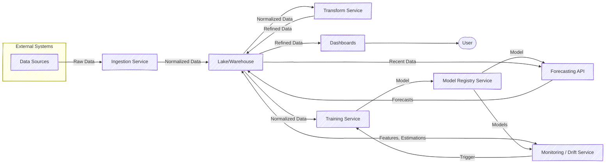
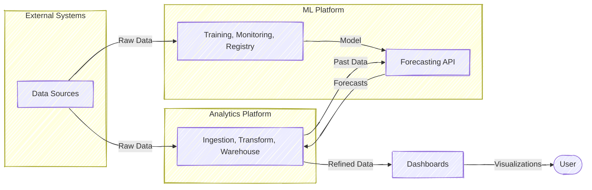
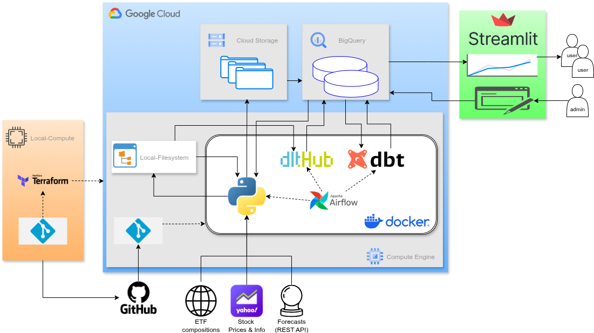

# Detailed Documentation

## Solution Architecture

### Alternatives

For the coupled operation of ML and Analytics platforms, following altenative architectures were considered (see the [blogpost](https://medium.com/@kerimoglu.o/an-ml-enhanced-analytics-platform-79e79709c9e6)).

#### The Monolithic Architecture

#### Microservice Architecture

#### The Macroservice Architecture

 ## Checklist:
  

| Option \ Factor          | Low complexity | Large team | Deep platform expertise | Ship fast |  Low ops budget | Indep. scaling needs |
| ------------------------ | -------------: | ---------: | ----------------------: | ----------------: |  -------------: | ------------------------------: |
| **Monolith**             |              ✓ |          ✗ |                       ✗ |                 ✓ |                                ✓ |                               ✗ |
| **Microservices** |              ✗ |          ✓ |                       ✓ |                 ✗ |                                ✗ |                               ✓ |
| **Macroservices**  |              ✓ |          ✓ |                       ✓ |                 ✓ |                               ✓ |                               ✗ |

Based on these considerations, the Macroservice architecture was adopted. 

## Detailed Architecture of the Analytics Platform
Here the L3-flowchart of the solution architecture of the Analytics Platform specifically:

  
  

3 main environments can be identified:
1. A local development environment (green box): this is where the code is developed/maintained and necessary cloud services (via [Terraform](#terraform)) are managed
2. The cloud environment (blue box): currently the [Google Cloud Platform](https://cloud.google.com/) (see: [cloud services](#cloud-services)), where source code is pulled from GitHub (automated via [scripts/startup.sh](scripts/startup.sh), which is set with the creation of the compute engine resource with Terraform), ran in a [Docker](https://www.docker.com/) container (see [Docker](Docker/airflow)), and data is persisted and processed in a data lake and data warehouse
3. [Streamlit Web-App](#streamlit-web-app) (orange box) that contains publicly accessible dashboards and admin interfaces to browse and manage ETFs to track.

